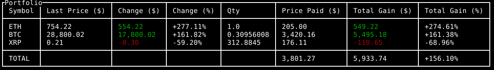

# Coinbase Terminal Portfolio Viewer

## What is it?
It is a python terminal application that displays a portfolio view of your
coinbase crypto positions. See screenshot below.

It uses only public, unauthenticated coinbase API endpoints for price data. Data
on your holdings comes from `positions.json`.

## How do I use it?
Follow `positions.example.json` as a guide and create your own `positions.json`
file. Then run `portfolio.py` and see your portfolio as it currently stands.

## Why?
I recently invested in crypto. I was disapointed I couldn't see a "portfolio"
view similar to what you'd see on ETRADE with regular securities. So I made
this.

## Improvements
* Use API keys to retreive position data from coinbase
* Distrubute as full application with OAuth if there's actual interest
